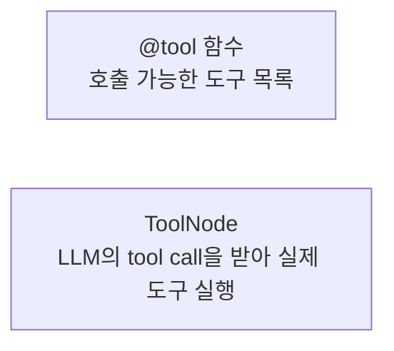
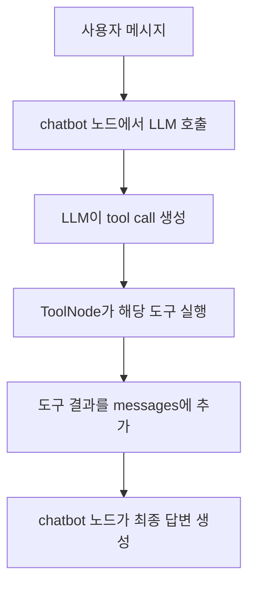
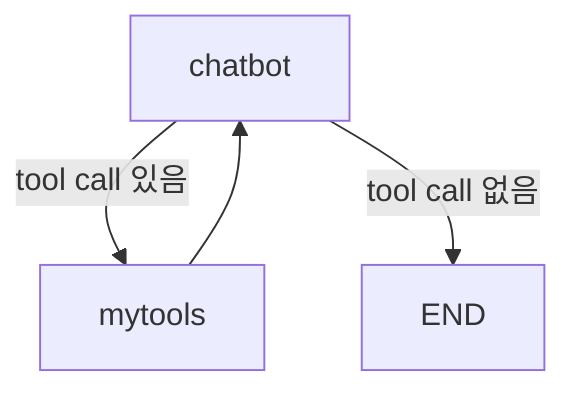

# LangGraph ToolNode

## 정의

`ToolNode`는 LangGraph에서 LLM이 요청한 tool call을 실제 도구 함수 실행으로 연결하는 미리 만들어진 노드이다.

```python
from langgraph.prebuilt import ToolNode

builder.add_node("mytools", ToolNode(mytools))
```

## 역할

`@tool` 함수는 도구 정의이고, `ToolNode`는 도구 실행 담당 노드이다.



## 기본 흐름



여기서 `chatbot` 노드의 핵심은 LLM에게 먼저 묻는 것이다.

```python
def chatbot(state: State):
    current_messages = state["messages"]
    response = llm_with_tools.invoke(current_messages)
    return {"messages": [response]}
```

`llm_with_tools.invoke(current_messages)`에서 LLM이 도구 호출 여부를 판단한다. `ToolNode`는 그 판단 결과에 tool call이 있을 때만 실제 도구를 실행한다.

## 예시 구조

```python
mytools = [food_tool, care_tool]
llm_with_tools = llm.bind_tools(mytools)

builder = StateGraph(State)
builder.add_node("chatbot", chatbot)
builder.add_node("mytools", ToolNode(mytools))
```

조건부 엣지와 함께 쓰면 도구 호출 여부에 따라 흐름을 나눌 수 있다.

```python
builder.add_conditional_edges("chatbot", tools_condition)
```

흐름:



## 주의점

`ToolNode`는 도구 호출을 실행할 뿐, 어떤 도구를 쓸지는 LLM이 결정한다.

도구 선택 품질은 다음에 영향을 받는다.

- 도구 이름
- 함수 인자 이름과 타입
- docstring
- 사용자 질문
- 시스템 프롬프트

## 기본 병렬 실행과 직렬화

여러 tool call이 한 AIMessage에 있으면 ToolNode는 독립 호출을 병렬 처리할 수 있다. 검색·조회처럼 서로 다른 자원만 읽는 도구에는 지연 시간을 크게 줄이는 좋은 기본값이다.

하지만 두 도구가 같은 mutable state를 수정하면 병렬 실행은 위험하다.

| 상황 | 예 | 권장 |
|---|---|---|
| 독립 조회 | 문서 검색과 고객 조회 | 병렬 실행 |
| 같은 state 쓰기 | 같은 캔버스·파일·주문 수정 | 모델이 낸 순서대로 직렬 실행 |
| 선후 의존 | 생성한 리소스를 다음 도구가 연결 | 명시적인 graph node 또는 직렬 실행 |
| 부분 실패가 허용됨 | 보조 검색 채널 하나 실패 | 실패 정보를 남기고 fail-soft |

공유 state에 쓰는 도구는 [[Concurrent Tool Execution]]의 transaction·versioning·직렬화 원칙을 따른다.

## Tool이 state를 갱신할 때

단순 도구는 `ToolMessage` 또는 데이터만 반환하면 된다. 도구 결과가 이후 노드가 읽는 state를 바꿔야 할 때는 [[LangGraph Command|`Command(update=...)`]]를 반환할 수 있다.

이때 `messages`처럼 병렬로 여러 도구가 갱신할 수 있는 키에는 reducer가 필요하다. 도구가 전체 state snapshot을 직접 덮어쓰면 다른 도구의 변경을 잃기 쉽다.

## 한 줄 정리

> ToolNode는 LLM이 만든 tool call을 받아 실제 `@tool` 함수를 실행해주는 LangGraph 노드이다.

관련:

- [[LangChain @tool]]
- [[LLM Tool Selection]]
- [[Tool Calling]]
- [[Workflow Node vs Tool]]
- [[LangGraph Command]]
- [[Concurrent Tool Execution]]
- [[Tool Execution Policy]]

## 공식 문서

- [LangChain Tools와 ToolNode](https://docs.langchain.com/oss/python/langchain/tools)
