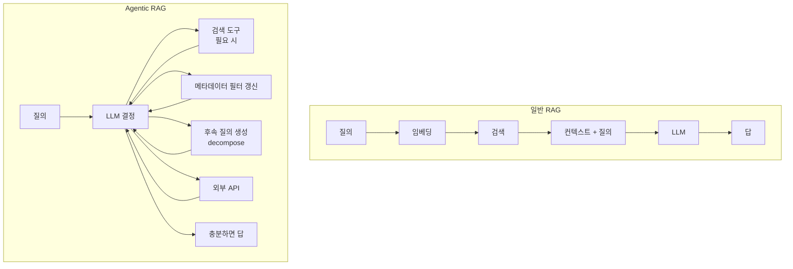

- Agentic RAG = 검색·재검색·다른 도구 호출을 **[[AI Agent|에이전트]]가 자율적으로 결정**하는 [[RAG(Retrieval-Augmented Generation)|RAG]] 변형.
- 일반 RAG가 "질의 → 1회 검색 → 생성"이라는 결정론적 파이프라인이라면, Agentic RAG는 **루프**다 — 한 번의 검색으로 부족하면 다시 검색, 다른 도구도 호출.

## 일반 RAG와의 차이



## 어떤 결정을 하나

1. **검색이 필요한가?** — 인사말이면 검색 없이 답.
2. **어떤 인덱스에서?** — 사내 매뉴얼 / FAQ / 코드 등 다중 인덱스 라우팅.
3. **쿼리를 어떻게 다듬을까?** — Query rewriting, HyDE(가상 답변 임베딩).
4. **결과가 충분한가?** — 부족하면 재검색·복합질의 분해.
5. **언제 멈출까?** — 답할 수 있다고 판단되면 종료.

## LangGraph 구현 (의사)

```python
def should_retrieve(state):
    # LLM이 결정: "검색이 필요한가?"
    return "retrieve" if llm.judge_needs_retrieval(state) else "answer"

def retrieve(state):
    return {"context": retriever.invoke(state["query"])}

def grade(state):
    # 검색 결과가 질문에 충분한가?
    return "answer" if llm.context_sufficient(state) else "rewrite"

def rewrite(state):
    return {"query": llm.rewrite(state["query"], state["context"])}

graph.add_conditional_edges("router", should_retrieve, {"retrieve":"retrieve","answer":"answer"})
graph.add_edge("retrieve", "grade")
graph.add_conditional_edges("grade", grade, {"answer":"answer","rewrite":"rewrite"})
graph.add_edge("rewrite", "retrieve")   # 사이클
```

## 대표 패턴

### Self-RAG

- 매 검색 후 "이 결과가 필요한가?"를 self-reflection.
- 불필요한 검색을 줄여 비용 절감.

### Corrective RAG (CRAG)

- 검색 결과의 **품질**을 별도 분류기로 평가.
- 낮으면 web search로 보강.

### Multi-Query / RAG-Fusion

- 한 질의에서 N개의 변형 쿼리를 생성 → 각각 검색 → 결과를 [[Hybrid Search|RRF]]로 융합.

### HyDE (Hypothetical Document Embeddings)

- 질의에 대한 "가상의 답변"을 LLM이 먼저 생성 → 그것을 임베딩해 검색.
- 짧은 질의로 잘 안 잡히는 문서를 끌어옴.

### Sub-question Decomposition

- 복합 질의를 N개 하위 질의로 분해 → 각각 RAG → 통합.

## 비용·지연 트레이드오프

- 매 결정마다 LLM 호출 → 일반 RAG보다 5~10배 비싸질 수 있다.
- 적용 영역: **답이 한 번 검색으로 안 나오는** 복잡한 도메인 (법률, 의료, 금융).
- 단순 FAQ는 그냥 RAG가 낫다.

## 운영 팁

- 결정 LLM은 작고 빠른 모델, 최종 생성 LLM은 강한 모델 → 라우팅으로 비용 통제.
- 모든 루프에 `max_iters` (보통 3~5).
- 각 검색 결과를 [[Trajectory]]로 보존 → 디버깅과 [[Evaluation|회귀 평가]] 시드.

## 관련

- [[RAG(Retrieval-Augmented Generation)]] · [[Hybrid Search]] · [[Reranking]].
- [[Agentic Loop]] — 본질은 같은 루프.
- [[Planning]] · [[Plan-and-Execute]] — Sub-question 분해.
- [[Knowledge Graph]] · [[GraphRAG]] — Agent가 그래프 쿼리까지 도구로.
