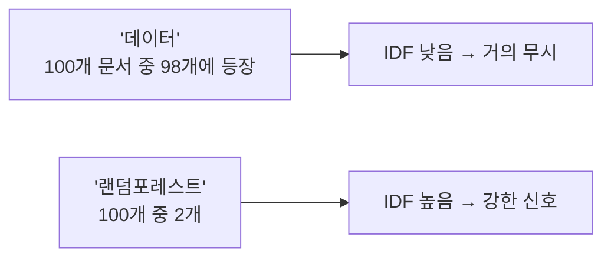

# TF-IDF

- [[BM25]] 점수의 뼈대다. **어떤 단어가 이 문서를 대표하는가**를 두 신호의 곱으로 본다.

| 신호 | 뜻 | 직관 |
|---|---|---|
| **TF** (Term Frequency) | 이 문서에 그 단어가 몇 번 나오나 | 많이 나올수록 그 문서 주제일 것 |
| **IDF** (Inverse Document Frequency) | 그 단어가 **몇 개 문서에** 나오나 | 드물수록 변별력이 크다 |

```text
score(단어, 문서) ≈ TF(단어, 문서) × IDF(단어)
```

## IDF가 핵심이다

`데이터`라는 단어가 모든 블록 설명에 나온다면, 그 단어로는 아무것도 구별 못 한다. IDF가 그런 단어의 가중치를 0에 가깝게 눌러 준다. 반대로 `랜덤포레스트`처럼 몇 문서에만 나오는 단어는 가중치가 크다.



## BM25가 TF-IDF에 더한 두 가지

**1) TF 포화(saturation)** — 단어가 10번 나온다고 점수가 10배가 되지 않는다. 어느 지점부터 완만해진다. 같은 단어를 도배한 문서가 이기는 걸 막는다.

**2) 문서 길이 정규화** — 긴 문서는 단순히 단어를 많이 포함하기 마련이다. 평균 길이 대비로 보정해 짧고 정확한 문서가 불리해지지 않게 한다.

## 왜 알아야 하나

이 성질이 **한국어 토큰 설계를 결정한다.** 희귀할수록 강해지는 IDF 때문에, 무심코 만든 희귀 토큰이 정직한 키워드를 이길 수 있다. [[한국어 토크나이징과 BM25]]에서 이어진다.

## 한 줄 정리

TF-IDF는 **자주 나오되 아무 데나 나오지는 않는 단어**에 높은 점수를 주고, BM25는 여기에 포화와 길이 보정을 더한 것이다.

## 관련

- [[BM25]]
- [[한국어 토크나이징과 BM25]]
- [[Hybrid Search]]
