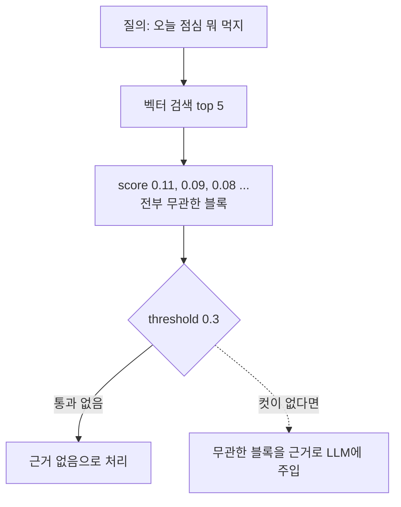

# score_threshold

- 유사도 점수가 이 값 미만인 결과를 **버리는 컷라인**이다.
- [[코사인 유사도]] 기준이면 1에 가까울수록 비슷하다. 프로젝트는 `RAG_SCORE_THRESHOLD = 0.3`을 쓴다.

## 왜 필요한가

벡터 검색은 **항상 top-K를 채워서 준다.** 아무리 무관한 문서라도 K개를 요청하면 K개가 온다. 컷이 없으면 "관련 문서 없음"이라는 상태가 아예 표현되지 않는다.

무관한 문서를 근거로 넣으면 [[Grounded Generation|근거 기반 생성]]이 오히려 오답을 만든다. 컷은 **환각을 막는 장치**다.

## 값을 정하는 감각

| 값 | 성향 |
|---|---|
| 높게 (0.6+) | 정밀도 ↑, 관련 문서를 놓칠 위험 ↑ |
| 낮게 (0.2~0.3) | 재현율 ↑, 잡음이 섞임 |

- 절대 기준은 없다. **[[임베딩(Embedding)|임베딩]] 모델과 문서 성격마다 점수 분포가 다르다.** [[BGE-M3]]에서 0.3인 값이 다른 모델에서는 다른 의미다.
- 정하는 방법은 하나뿐이다. 실제 질의 로그의 점수 분포를 찍어 보고, 맞는 문서와 틀린 문서가 갈리는 지점을 고른다.
- 컷 이후에도 후보가 남도록 `k`를 여유 있게 잡는다. 우리 코드가 `k=max(k, 5)`를 쓰는 이유다.

## 혼동 주의

| 개념 | 하는 일 |
|---|---|
| `score_threshold` | **채널 안에서** 쓰레기를 자름 |
| [[Reciprocal Rank Fusion]] | **채널 사이를** 합침 |
| [[Recall과 ef 튜닝\|hnsw_ef]] | 탐색을 얼마나 넓게 할지 |

이름이 비슷해 섞이기 쉽지만 세 개가 서로 다른 층에서 논다.

## 한 줄 정리

score_threshold는 **"관련 문서 없음"을 표현할 수 있게 해 주는 컷**이고, 모델마다 다시 정해야 한다.

## 관련

- [[코사인 유사도]]
- [[Qdrant query_points]]
- [[Pre-filtering vs Post-filtering]]
- [[Grounded Generation]]
- [[BGE-M3]]
