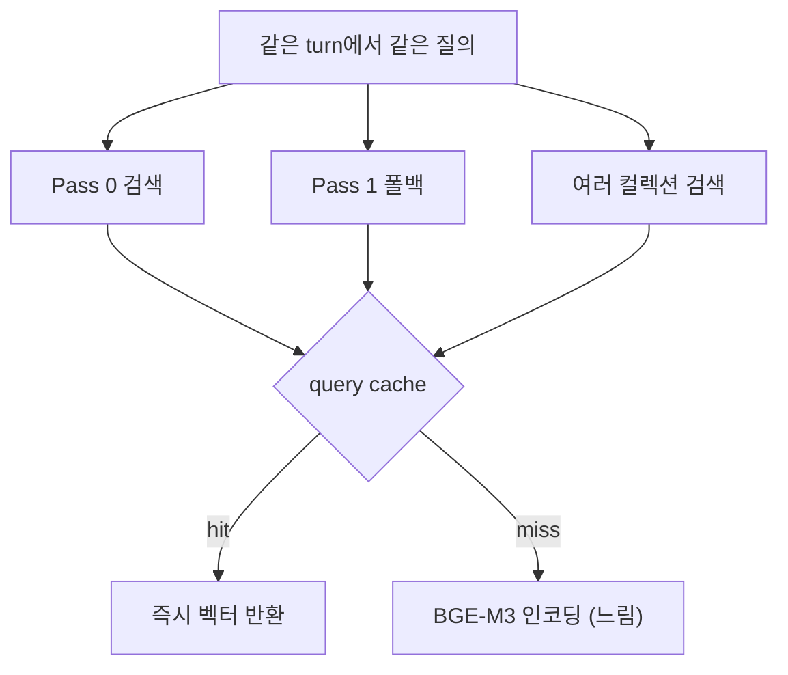

# 임베딩 모델 로딩 패턴

- [[BGE-M3]] 같은 로컬 임베딩 모델은 **수 GB를 메모리에 올린다.** 요청마다 로드하면 서버가 죽는다.
- 그래서 로딩·재사용·캐싱에 정해진 패턴이 붙는다.

## 1. Thread-safe 싱글톤 ([[Double-Checked Locking]])

```python
_embeddings = None
_embeddings_lock = threading.Lock()

def get_embeddings():
    global _embeddings
    if _embeddings is None:              # First check — lock 없이 (빠른 경로)
        with _embeddings_lock:
            if _embeddings is None:      # Second check — lock 안에서 (정확성)
                _embeddings = HuggingFaceEmbeddings(...)
    return _embeddings
```

첫 검사로 **이미 만들어진 뒤에는 lock을 아예 안 잡고**, 두 번째 검사로 동시 진입 시 중복 로딩을 막는다. [[Singleton Pattern]] + [[Lazy Initialization]]의 조합이다.

## 2. 필수 설정

```python
HuggingFaceEmbeddings(
    model_name="BAAI/bge-m3",
    model_kwargs={"device": device, "local_files_only": True},
    encode_kwargs={"normalize_embeddings": True, "batch_size": 64},
)
```

| 설정 | 왜 |
|---|---|
| `normalize_embeddings=True` | 벡터 길이를 1로. [[코사인 유사도]] 계산의 전제 |
| `batch_size=64` | GPU 배치 처리 — 인덱스 재빌드 속도 |
| `local_files_only=True` | 내부망. 외부 다운로드 시도 자체를 차단 |
| `cache_folder` | 모델 캐시 위치를 프로젝트에 고정 |

## 3. 디바이스 결정 — 실패를 구분해서 남긴다

```python
def _resolve_embedding_device() -> str:
    configured = os.getenv(EMBEDDING_DEVICE_ENV)
    if configured:
        return configured                      # 명시 설정이 있으면 탐지 자체를 안 함
    try:
        import torch
    except ImportError as error:
        logger.info("torch 미설치로 CPU 임베딩 사용: %s", error)
        return DEFAULT_CPU_DEVICE
    try:
        cuda_available = torch.cuda.is_available()
    except RuntimeError as error:
        logger.warning("CUDA 초기화 실패로 CPU 임베딩 사용: %s", error)
        return DEFAULT_CPU_DEVICE
    return DEFAULT_CUDA_DEVICE if cuda_available else DEFAULT_CPU_DEVICE
```

`torch 미설치`와 `CUDA 초기화 실패`는 **결과가 같아도(CPU 사용) 원인이 다르다.** 한 덩어리로 삼키면 배포 환경에서 오진한다. 로그 레벨도 다르다(info / warning).

## 4. 질의 임베딩 캐시 (LRU)

```python
class QueryCachingEmbeddings(Embeddings):
    def embed_query(self, text: str) -> list[float]:
        with self._cache_lock:
            cached = self._cache.get(text)
            if cached is not None:
                self._cache.move_to_end(text)     # 최근 사용으로 이동
                return cached
        vector = self._inner.embed_query(text)
        with self._cache_lock:
            self._cache[text] = vector
            self._cache.move_to_end(text)
            while len(self._cache) > self._max_entries:
                self._cache.popitem(last=False)   # 가장 오래된 것 제거
        return vector

    def embed_documents(self, texts):             # 재빌드 전용 — 캐시 안 함
        return self._inner.embed_documents(texts)
```



- 같은 turn 안에서 다단계 [[Fallback|폴백]]과 여러 컬렉션 검색이 **같은 문장을 반복 임베딩**하는 게 주요 지연이었다.
- 질의 임베딩은 (모델, 텍스트)에 대해 **결정적**이라 캐시가 안전하다.
- `embed_documents`는 재빌드 전용 대량 경로라 캐시하지 않는다. 캐시해 봐야 다시 안 쓴다.
- `OrderedDict` + `move_to_end` + `popitem(last=False)`가 LRU의 표준 구현이다.

## 한 줄 정리

임베딩 모델은 **싱글톤으로 한 번 올리고, 정규화를 켜고, 질의 벡터는 LRU로 재사용**한다.

## 관련

- [[BGE-M3]]
- [[임베딩(Embedding)]]
- [[코사인 유사도]]
- [[Double-Checked Locking]]
- [[Singleton Pattern]]
- [[Lazy Initialization]]
- [[LangChain VectorStore 메서드]]
- [[threading.RLock]]
