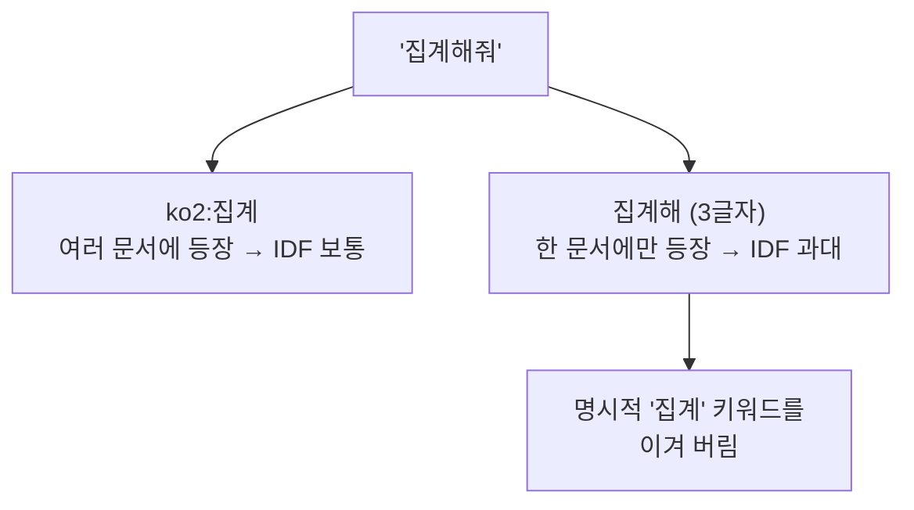

# 한국어 토크나이징과 BM25

- [[BM25]]는 **토큰이 정확히 같아야** 점수가 붙는다. 그런데 한국어는 조사·어미가 붙는 교착어다.

```text
사용자: "집계해줘"      Catalog 키워드: "집계"
공백 토큰만 쓰면 → 다른 토큰 → 0점
```

영어라면 `aggregating` → `aggregat` 정도의 어간 추출(stemming)로 끝나는 문제인데, 한국어는 그게 안 된다.

## 선택지 셋

| 방법 | 장점 | 단점 |
|---|---|---|
| 형태소 분석기 (Kiwi, Mecab) | 정확한 어간 분리 | 설치·사전 관리·속도, 내부망 배포 부담 |
| n-gram 전면 분해 | 뭐든 걸린다 | 잡음 폭증, IDF 왜곡 |
| **경계 있는 접두사 gram** | 가볍고 예측 가능 | 완전하진 않음 |

프로젝트는 셋째를 쓴다. **한글 토큰의 앞 2글자만 보조 토큰으로 추가**한다.

```python
tokens.append(token)                       # 원 토큰: 집계해줘
if _HANGUL_TOKEN_RE.fullmatch(token):
    tokens.append(f"ko2:{token[:2]}")      # 보조 토큰: ko2:집계
```

블록 ID(`TSM0004`)나 영문 옵션 키는 원 토큰 그대로 둔다. 자를 이유가 없다.

## 왜 2글자인가 — [[TF-IDF|IDF]] 때문이다



- 3~4글자 접두사는 **너무 희귀해져** IDF가 과하게 커진다. 희귀할수록 강해지는 성질이 여기선 독이다.
- 토큰 **내부 모든 위치**를 자르면 `집계해줘`의 `계해` 같은 어절 경계를 무시한 조각이 생긴다. 같은 문제다.
- 그래서 **앞에서만, 2글자만.** 완벽하진 않지만 오탐을 만들지 않는 선이다.

## 색인 대상도 설계다

이름·설명·category·`use_when`·`keywords`·`aliases`는 넣지만 **`when_not_to_use`는 넣지 않는다.** 그건 "쓰면 안 되는 상황"을 적은 **부정 근거**라, 색인하면 하지 말라는 상황에 그 블록이 뜬다. BM25는 긍정·부정을 구별하지 못한다.

## 한 줄 정리

한국어 BM25는 **형태소 분석기 없이 앞 2글자 보조 토큰**으로 조사 문제를 풀되, IDF 왜곡을 피하려고 그 이상 자르지 않는다.

## 관련

- [[BM25]]
- [[TF-IDF]]
- [[Hybrid Search]]
- [[Hybrid RAG Search]]
