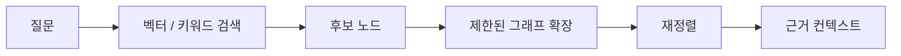

# Graph Data Modeling

Graph Data Modeling은 그래프 DB에 무엇을 노드·관계·속성으로 둘지, 그리고 어떤 탐색 질문을 빠르게 만들지를 설계하는 일이다. 좋은 모델은 데이터 분류표가 아니라 **자주 실행할 질의의 모양**에서 출발한다.

## 먼저 질문을 쓴다

1. 사용자가 실제로 묻는 경로를 문장으로 쓴다.
2. 그 경로에서 독립 식별자와 생명 주기를 가진 대상을 노드로 정한다.
3. 두 노드 사이의 의미 있는 연결을 방향·타입이 있는 관계로 정한다.
4. 관계 자체의 성질은 관계 속성으로 둔다.
5. 샘플 데이터와 Cypher로 질의·성능을 검증한 뒤 모델을 고친다.

예를 들어 "이 블록을 쓰려면 무엇이 먼저 필요한가"라는 질문은 다음처럼 표현할 수 있다.

```text
(후행 블록)-[:REQUIRES_BEFORE]->(선행 블록)
```

관계 방향은 문장으로 읽어도 자연스러워야 한다. `REQUIRES_BEFORE`와 `OFTEN_PAIRED`는 같은 선으로 보이지만 의미·가중치·탐색 정책이 다르다.

## 노드, 관계, 속성의 선택

| 선택 | 적합한 경우 | 예 |
|---|---|---|
| 노드 | 독립 ID, 여러 관계, 자체 속성이 있을 때 | 문서, 제품, 사용자, 블록 |
| 관계 | 두 대상의 연결 자체가 의미 있을 때 | `DEPENDS_ON`, `AUTHORED_BY` |
| 관계 속성 | 연결의 시점·강도·출처가 중요할 때 | `weight`, `observed_at`, `source` |
| 노드 속성 | 해당 대상만의 단순 값일 때 | 이름, 상태, 버전 |

모든 문자열을 노드로 만들면 탐색은 복잡해지고, 모든 관계를 속성으로 만들면 다단계 탐색을 잃는다. 반복해서 연결·필터링할 대상만 그래프로 승격한다.

## Cypher의 기본 패턴

```cypher
// 고유 식별자로 시작점을 좁힌 뒤, 관계 타입과 hop 수를 제한한다.
MATCH (start:Block {block_id: $block_id})
MATCH path = (start)-[:REQUIRES_BEFORE|OFTEN_PAIRED*1..2]-(neighbor:Block)
RETURN DISTINCT neighbor.block_id, length(path) AS hops
ORDER BY hops
LIMIT 20
```

- 시작 노드를 ID, label, index로 먼저 좁힌다.
- 관계 타입과 최대 hop을 제한한다.
- 반환량과 경로 수에 상한을 둔다.
- 사용자 입력은 문자열 조합으로 Cypher에 넣지 말고 `$parameter`로 바인딩한다.

무제한 `*` 탐색은 고차수 노드에서 후보를 폭발시킨다. 그래프 검색은 "더 많이 연결"하는 기능이 아니라, **정해진 의미 관계만 따라 필요한 컨텍스트를 추가하는 기능**이다.

## 인덱스와 제약

- 고유 ID에는 uniqueness constraint를 둔다. 중복 노드는 traversal과 집계를 왜곡한다.
- 정확 필터에는 range, text, token index를 사용한다.
- 의미 검색에는 vector index, 키워드 검색에는 full-text index를 사용한다.
- 인덱스는 데이터 모델의 대체물이 아니다. 먼저 질의 패턴과 관계 방향을 고친다.

## RAG와 결합하는 방법



벡터 검색으로 semantic seed를 찾고, 그래프에서 전제·의존·공동 사용 관계를 제한적으로 확장하는 방식은 [[Hybrid RAG Search]]에 적합하다. 그래프가 이미 정교한 도메인 사실을 갖고 있다면 자연어를 [[Knowledge Graph|Text-to-Cypher]]로 바꾸는 방식도 가능하지만, 생성된 Cypher는 allowlist·파라미터·읽기 전용 권한으로 제한해야 한다.

## 관련

- [[Knowledge Graph]]
- [[Ontology]]
- [[GraphRAG]]
- [[Lexical Graph RAG]]
- [[Hybrid RAG Search]]
- [[Graph Traversal Retrieval]]
- [[Query Transformation]]

## 공식 문서

- [Neo4j 그래프 데이터 모델링](https://neo4j.com/docs/getting-started/data-modeling/)
- [Cypher 질의 개요](https://neo4j.com/docs/cypher-manual/current/queries/)
- [Neo4j 인덱스](https://neo4j.com/docs/cypher-manual/current/indexes/)
- [Neo4j GraphRAG Retriever](https://neo4j.com/docs/neo4j-graphrag-python/current/user_guide_rag.html)
