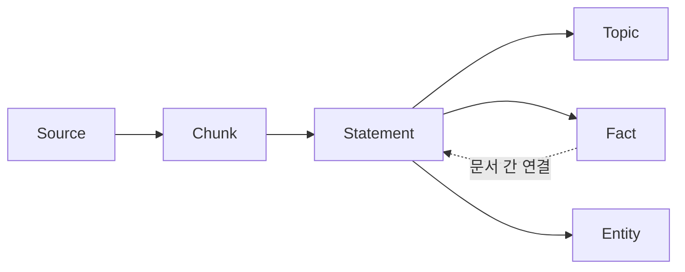
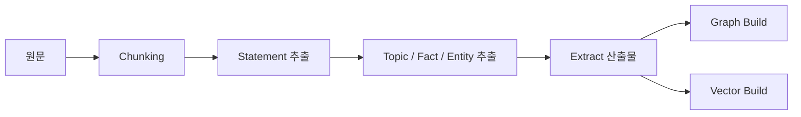

# Lexical Graph RAG

Lexical Graph RAG는 원문을 단순 [[청킹(Chunking)|청크]]로만 검색하지 않고, **독립적으로 검증 가능한 문장(Statement)** 을 중심으로 [[Knowledge Graph|지식 그래프]]와 벡터 인덱스를 함께 만드는 검색 설계다. 질문에 가까운 청크를 벡터로 찾되, 그래프의 출처·주제·사실 관계를 따라가며 LLM에 전달할 근거 문장을 고른다.

일반 [[GraphRAG]]의 한 구현 계열이다. 핵심은 "그래프를 만든다"가 아니라 **답변의 최소 근거 단위를 문장으로 만들고, 그 문장의 계보와 연결성을 보존한다**는 데 있다.

## 왜 청크만으로 부족한가

청크는 임베딩과 저장에 편하지만, 다음 문제가 있다.

- 하나의 청크에 여러 주장과 주제가 섞여 있어 답변 근거가 흐려진다.
- 여러 문서에 흩어진 같은 사실을 연결하기 어렵다.
- 검색 결과가 원문의 어느 부분에서 왔는지 추적하기 어렵다.

Lexical Graph는 청크를 **검색 진입점**으로 유지하면서, 실제 컨텍스트는 더 작은 Statement 단위로 전달한다. 따라서 검색 비용과 근거 정밀도 사이를 분리해서 다룰 수 있다.

## 데이터 모델

| 계층 | 노드 | 책임 |
|---|---|---|
| 계보 | Source, Chunk | 원본, 버전, 위치를 추적하고 검색의 진입점을 제공한다. |
| 요약 | Statement, Topic, Fact | LLM에 줄 최소 근거를 만들고, 같은 문서와 다른 문서의 연결을 구분한다. |
| 의미 | Entity, Relation | 도메인 개체와 관계를 표현해 구조적 탐색을 가능하게 한다. |

- **Source**: 원문 메타데이터와 버전의 기준점이다.
- **Chunk**: [[임베딩(Embedding)|벡터 검색]]에 적합한 후보 단위다.
- **Statement**: 주어가 생략되지 않고, 단독으로 참·거짓을 판단할 수 있는 문장이다.
- **Topic**: 같은 Source 안의 Statement를 묶는 로컬 연결이다.
- **Fact**: 서로 다른 Source의 Statement를 연결하는 글로벌 연결이다.
- **Entity / Relation**: 사람, 제품, 규정처럼 도메인에서 반복되는 개체와 관계다.

Topic과 Fact를 구분하면 "이 문서 안에서 먼저 읽기"와 "문서를 넘어서 비교하기"를 다른 탐색 정책으로 운영할 수 있다.

## 인덱싱: Extract와 Build를 분리한다

### 1. Extract

Extract는 원문을 읽어 재처리 가능한 중간 산출물로 바꾸는 단계다.

1. 문서 형식에 맞춰 청킹한다. Markdown은 헤딩 구조를 보존하고, 표나 코드 블록은 의미가 잘리지 않게 처리한다.
2. 각 청크에서 대명사와 생략어를 풀어 **독립 명제**를 추출한다.
3. 명제에서 Topic, Fact, Entity, Relation을 추출한다.
4. 원본 위치, 모델·프롬프트 버전, 처리 시각을 함께 저장한다.

Extract 결과를 보존하면 모델이나 프롬프트를 바꿨을 때 그래프 적재만 다시 하거나, 특정 문서만 선택적으로 재추출할 수 있다. LLM 비용이 큰 파이프라인에서 특히 중요한 경계다.

### 2. Build

Build는 Extract 산출물을 그래프 스토어와 [[벡터 데이터베이스]]에 적재하는 단계다.

- Source-Chunk-Statement의 계보 관계를 생성한다.
- 문서 내부의 Topic 연결과 문서 간 Fact 연결을 생성한다.
- 검색 대상으로 정한 Chunk, Topic, Statement에 임베딩을 만든다.
- 동일 개체의 중복, 관계 방향, 스키마 제약을 검증한다.

대량 문서는 Extract를 배치 처리하고 Build를 별도 작업으로 분리한다. 이때 Extract 산출물에 컬렉션 ID와 버전을 둬야 새 인덱스와 이전 인덱스가 섞이지 않는다.

## 검색 전략

| 질문 성격 | 시작점 | 확장 방식 |
|---|---|---|
| 특정 사실 확인 | Chunk / Statement | 출처와 인접 Statement만 확인 |
| 한 문서의 맥락 이해 | Chunk | 같은 Topic 내부를 우선 탐색 |
| 문서 간 비교·변화 추적 | Entity / Fact | Fact를 통해 다른 Source로 확장 |
| 관계형 질문 | Entity | Relation을 따라 필요한 깊이만 탐색 |

기본 전략은 **벡터 검색으로 시작하고 그래프로 좁혀 가는 것**이다. 그래프를 무제한으로 순회하면 관련 없는 문장이 섞이므로, 최대 hop 수·노드 수·문서 수·최소 유사도 같은 예산을 둔다. 이 제한은 [[Hybrid Search]]와 [[Reranking]]을 함께 쓸 때도 필요하다.

## 품질을 좌우하는 조건

- Statement는 독립적으로 읽혀야 한다. "이는", "그 제품" 같은 지시어를 원래 이름으로 치환한다.
- 하나의 Statement에는 가능한 한 하나의 검증 가능한 주장을 둔다.
- Entity 정규화 규칙을 둔다. 별칭, 표기 차이, 버전명은 같은 개체로 합치되 근거 없는 병합은 피한다.
- 원문으로 돌아갈 수 없는 노드는 답변 근거로 사용하지 않는다.
- 추출 정확도, 관계 정확도, 검색 재현율, 근거 인용 정확도를 분리해 평가한다. 그래프가 커졌다는 사실은 검색 품질을 뜻하지 않는다.

## 언제 적합한가

- 규정, 기술 문서, 논문처럼 출처와 세부 주장 인용이 중요한 경우
- 여러 문서의 변경 이력, 의존성, 비교 관계를 자주 묻는 경우
- 도메인 [[Ontology]]가 있거나, 개체 정규화에 투자할 수 있는 경우

짧고 독립적인 FAQ처럼 문서 간 관계가 약한 데이터에는 일반 [[RAG(Retrieval-Augmented Generation)]] 또는 [[Hybrid Search]]가 더 단순하고 비용 효율적이다. 그래프를 채택하기 전에는 먼저 질문이 정말로 문서 간 관계와 근거 추적을 요구하는지 확인한다.

## 관련

- [[GraphRAG]]
- [[Knowledge Graph]]
- [[Hybrid Search]]
- [[청킹(Chunking)]]
- [[Reranking]]
- [[Ontology]]
