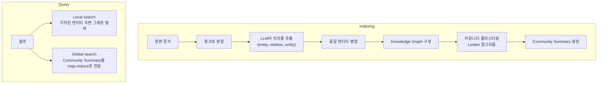

- GraphRAG는 일반 [[RAG(Retrieval-Augmented Generation)]]가 약한 **"여러 문서를 가로지르는 추론(global question)"** 을 해결하기 위해, 문서에서 **엔티티-관계 그래프**를 추출해 활용하는 방식이다.
- Microsoft Research에서 2024년 공개한 [GraphRAG](https://github.com/microsoft/graphrag) 구현이 가장 유명.

## 기존 RAG의 한계

- 청크 유사도 검색은 **"이 한 문단에서 답할 수 있는 질문"** 에 강하다.
- 그러나 "이 회사 보고서 전체에서 가장 중요한 리스크 3가지는?" 같은 **요약형/관계형 질문**은 청크 단위 검색으로 답 못 한다.

## 구조



## 의사 코드 (개념적)

```python
def graphrag_index(docs):
    chunks = split(docs)
    triples = []
    for chunk in chunks:
        triples += llm.extract_triples(chunk)
    graph = build_graph(triples)
    communities = leiden_cluster(graph)
    summaries = {c: llm.summarize(c.nodes) for c in communities}
    return graph, summaries

def graphrag_global_query(question, summaries):
    partial_answers = [llm.answer(question, s) for s in summaries.values()]
    return llm.reduce(question, partial_answers)
```

## 장점

- **요약형·관계형 질문**에 답 가능.
- 엔티티 단위로 정보를 통합해 환각이 줄어든다.

## 단점

- **인덱싱 비용이 크다** — 청크마다 LLM 호출이 필요해 일반 RAG의 10~100배 비용.
- 트리플 추출이 노이즈가 많으면 그래프 품질이 떨어짐.
- 운영 인프라(그래프 DB) 추가.

## 변종

- **Microsoft GraphRAG** — 위에서 설명한 표준 구현.
- **LightRAG** — 듀얼 레벨(low-level entity, high-level concept) 검색.
- **Hybrid GraphRAG** — 그래프 검색 + 일반 벡터 검색 결합.

## 언제 쓰나

- 문서가 서로 강하게 연결된 도메인 (법률 판례, 의학 케이스, 기업 보고서, 미래에셋 같은 금융상품 지식 DB).
- "전체 관점"의 질문이 많을 때.
- 그렇지 않다면 일반 [[RAG(Retrieval-Augmented Generation)]] + [[Hybrid Search]] + [[Reranking]] 조합이 훨씬 가성비가 좋다.
