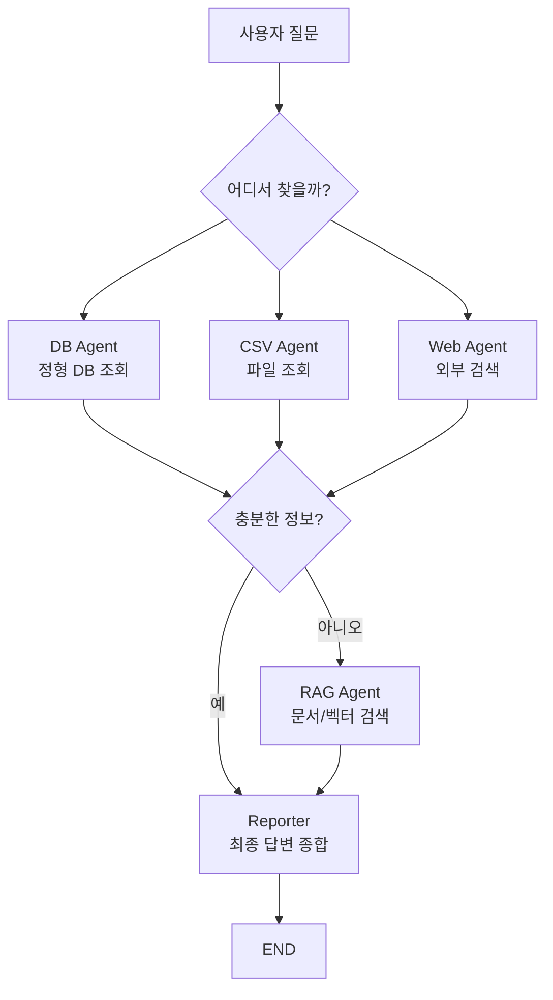
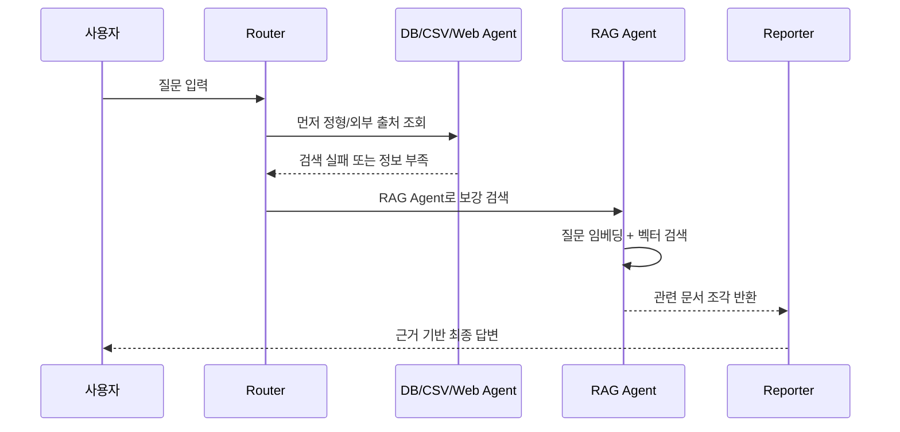

# RAG Agent

- RAG Agent = [[RAG(Retrieval-Augmented Generation)]] 검색 기능을 도구처럼 가지고, 필요한 문서를 찾아 LLM 답변에 붙여주는 [[AI Agent|에이전트]]다.
- DB Agent, CSV Agent, Web Agent가 각각 정해진 출처를 조회한다면, RAG Agent는 문서 묶음이나 벡터 DB에서 의미 기반으로 관련 내용을 찾는다.
- 실습 관점에서는 `DB/CSV/Web에서 검색이 안 되거나 부족할 때 RAG Agent로 보강한다`고 이해하면 좋다.

## 왜 필요한가

- DB Agent는 정확한 key가 있어야 잘 찾는다.
  - 예: `고혈압`, `당뇨`처럼 DB에 등록된 질병명.
  - 사용자가 비슷한 말이나 긴 증상을 말하면 못 찾을 수 있다.

- CSV Agent는 파일 안에 있는 컬럼과 값 중심으로 찾는다.
  - 구조는 단순하지만 의미 기반 검색에는 약하다.

- Web Agent는 최신 정보에는 강하지만 출처 신뢰도, 개인정보 유출, 검색 품질 문제가 있다.

- RAG Agent는 문서를 [[청킹(Chunking)]]하고 [[임베딩(Embedding)]]해서 [[벡터 데이터베이스]]에 넣어둔 뒤, 질문과 의미가 가까운 문서를 찾아온다.
  - 정확히 같은 단어가 없어도 비슷한 의미의 문서를 찾을 수 있다.
  - 사내 문서, PDF, 매뉴얼, 강의자료, 보고서 검색에 적합하다.

## 전체 구조



## DB/CSV/Web Agent와 RAG Agent 차이

| 구분 | 주로 찾는 방식 | 강점 | 약점 |
|---|---|---|---|
| DB Agent | SQL / key 조회 | 정확하고 구조화된 데이터 | 등록되지 않은 표현에 약함 |
| CSV Agent | 파일 row/column 조회 | 실습·소규모 데이터에 쉬움 | 검색·확장성이 약함 |
| Web Agent | 외부 웹 검색 | 최신 정보 | 출처 신뢰도 관리 필요 |
| RAG Agent | 의미 기반 문서 검색 | 비슷한 의미의 문서 검색 가능 | 인덱싱 품질, 청킹 품질에 영향 받음 |

## RAG Agent가 쓰이는 상황

- 사용자가 DB에 없는 표현으로 질문할 때
  - 예: DB에는 `고혈압`이 있는데 사용자는 `혈압이 높은 사람 식단`이라고 말함.

- CSV에 정확한 row가 없을 때
  - 예: CSV에는 `증상`, `치료법`만 있는데 사용자는 긴 문장으로 생활 관리법을 물어봄.

- Web 검색이 부정확하거나 너무 넓을 때
  - 예: 웹에는 광고성 글이 많고, 실제로는 내부 PDF 자료를 참고해야 함.

- PDF, 강의자료, 매뉴얼, 사내 지식 문서를 참고해야 할 때
  - 예: [[OCR]], [[PyMuPDF]], [[VLM]]으로 문서를 텍스트화한 뒤 벡터 DB에 넣고 검색.

## 동작 흐름



## LangGraph 관점

- RAG Agent는 하나의 노드로 둘 수 있다.
- 또는 `retrieve_node`, `grade_node`, `rewrite_node`, `answer_node`로 나눠 작은 RAG 워크플로우를 만들 수도 있다.
- 정보가 부족하면 RAG Agent로 보내는 구조는 [[Fallback]]과 [[Routing Workflow]]가 결합된 형태다.
- 검색 결과가 충분한지 평가하고 부족하면 재검색하는 구조는 [[Agentic RAG]]에 가깝다.

## 의사 코드

```python
def route_after_local_search(state):
    if state["found"] and state["confidence"] >= 0.8:
        return "reporter"
    return "rag_agent"

@tool
def rag_search_tool(query: str):
    """내부 문서 벡터 DB에서 관련 문서를 검색할 때 사용한다."""
    docs = retriever.invoke(query)
    return "\n\n".join(doc.page_content for doc in docs)

rag_agent = create_react_agent(
    llm,
    tools=[rag_search_tool],
    prompt="너는 내부 문서를 검색해서 근거를 찾아주는 RAG 담당 에이전트다."
)
```

## 구현할 때 중요한 것

- RAG Agent를 쓰려면 먼저 문서를 인덱싱해야 한다.
  - PDF 추출: [[PyMuPDF]]
  - 스캔 문서: [[OCR]], [[VLM]]
  - 청킹: [[청킹(Chunking)]]
  - 임베딩: [[임베딩(Embedding)]]
  - 저장: [[벡터 데이터베이스]]

- RAG Agent는 마법처럼 모르는 정보를 찾는 게 아니다.
  - 벡터 DB에 넣어둔 문서 범위 안에서 찾는다.
  - 문서 품질, OCR 품질, 청킹 품질, embedding 품질에 영향을 받는다.

- 최종 답변에는 가능한 근거 문서의 제목, 페이지, 출처를 같이 붙인다.

## 한 줄 정리

- DB/CSV/Web Agent가 못 찾거나 정보가 부족할 때, RAG Agent는 내부 문서와 벡터 DB를 의미 기반으로 검색해서 답변 근거를 보강하는 에이전트다.

## 관련

- [[Agentic RAG]]
- [[RAG(Retrieval-Augmented Generation)]]
- [[Retrieve-Generate 패턴]]
- [[로컬 우선 정보 수집 MAS]]
- [[Fallback]]
- [[Routing Workflow]]
- [[벡터 데이터베이스]]
- [[임베딩(Embedding)]]
- [[청킹(Chunking)]]
