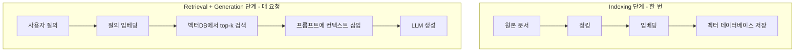

- RAG = **검색 증강 생성**. [[LLM(Large Language Model)]]이 답을 생성하기 전에 외부 지식 베이스에서 관련 문서를 검색해 프롬프트에 끼워 넣는 패턴이다.
- LLM의 두 가지 약점, **(1) 학습 시점 이후 정보 부재**, **(2) 사내 문서 미학습**을 동시에 해결한다. 환각(hallucination)도 줄어든다.
- 대안인 fine-tuning은 비용·시간·재학습 부담이 크지만, RAG는 인덱스만 갱신하면 되므로 운영 친화적이다.

## 전체 흐름



- LangGraph로 표현한 단순 검색-생성 흐름은 [[Retrieve-Generate 패턴]] 참고.

## 가장 단순한 구현 (LangChain)

```python
from langchain_community.vectorstores import Chroma
from langchain_openai import OpenAIEmbeddings, ChatOpenAI
from langchain_text_splitters import RecursiveCharacterTextSplitter
from langchain.chains import RetrievalQA

# 1) 인덱싱
docs = load_documents("./docs")  # 임의 로더
splits = RecursiveCharacterTextSplitter(chunk_size=500, chunk_overlap=50).split_documents(docs)
vectordb = Chroma.from_documents(splits, embedding=OpenAIEmbeddings())

# 2) 검색 + 생성
qa = RetrievalQA.from_chain_type(
    llm=ChatOpenAI(model="gpt-4"),
    retriever=vectordb.as_retriever(search_kwargs={"k": 4}),
)
answer = qa.invoke("환불 정책이 뭐야?")
```

## 핵심 설계 포인트

1. **[[청킹(Chunking)]] 전략** — 너무 작으면 맥락 부족, 너무 크면 노이즈·비용 증가. 보통 300~800 토큰 + 10~20% overlap.
2. **임베딩 모델 선택** — OpenAI `text-embedding-3-large`, Cohere `embed-multilingual-v3`, BGE-M3 등. 한국어 성능 차이 큼.
3. **[[Hybrid Search]]** — 벡터 검색 + BM25 같은 키워드 검색 결합. 고유명사·코드·정확한 용어에 강해진다.
4. **[[Reranking]]** — 1차로 많이 뽑고(top-50), cross-encoder로 재정렬해 top-3~5만 LLM에 넘긴다.
5. **컨텍스트 윈도우 관리** — 검색 결과가 LLM의 컨텍스트 한계를 넘지 않도록 동적 절단.

## 발전형

- [[GraphRAG]] — 문서 간 관계를 그래프로 표현해 다단계 추론.
- **Agentic RAG** — [[AI Agent|에이전트]]가 직접 검색·재검색·다른 도구 호출을 자율 결정.
- **Multi-hop RAG** — 한 번의 검색으로 부족할 때 결과를 보고 다시 검색.

## 흔한 실패 원인

- 청크가 의미 단위로 끊겨 있지 않다 (예: 표 한가운데서 잘림).
- 임베딩 모델과 LLM의 언어·도메인 불일치 (영어 임베딩 + 한국어 질의).
- top-k가 너무 크면 노이즈가 답을 흐림.
- 검색은 잘 됐는데 프롬프트가 "주어진 컨텍스트만 사용하라"를 강제하지 않아 LLM이 자기 지식으로 답함.
