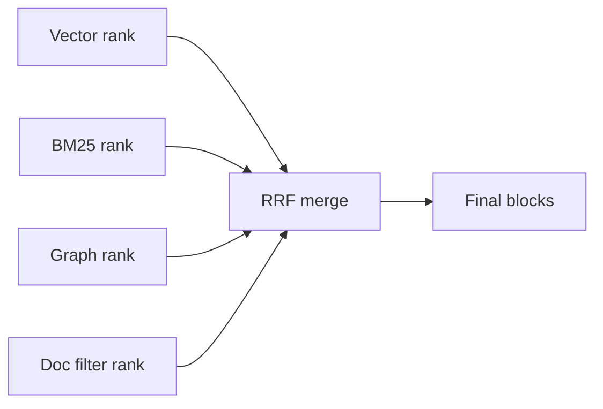

# Reciprocal Rank Fusion

Reciprocal Rank Fusion, 줄여서 RRF는 여러 검색 결과 리스트를 하나의 랭킹으로 합치는 방법이다.

프로젝트에서는 vector, [[BM25]], graph, document filter 결과를 합쳐 최종 블록 후보를 고를 때 사용한다.

## 공식

```text
score(d) = sum(1 / (k + rank(d)))
```

- `rank(d)`는 각 검색 채널에서 문서가 몇 번째로 나왔는지다.
- `k`는 보통 60을 많이 쓴다.
- 점수 자체보다 여러 채널에서 꾸준히 상위에 나온 문서를 올리는 것이 목적이다.

## 왜 좋은가

- 채널마다 score 스케일이 달라도 된다.
- vector score와 BM25 score를 직접 비교하지 않아도 된다.
- 한 채널에서 1등만 한 문서보다 여러 채널에서 상위권인 문서를 선호한다.

## 흐름



## 한 줄 정리

RRF는 **서로 다른 검색 채널의 순위를 점수화해 안정적인 최종 랭킹으로 합치는 방법**이다.

## 관련

- [[Hybrid RAG Search]]
- [[BM25]]
- [[BGE-M3]]
- [[Reranking]]
