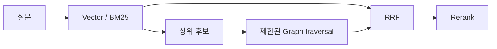

# Hybrid RAG Search

Hybrid RAG Search는 여러 검색 채널을 동시에 사용해 더 안정적인 후보를 찾는 방식이다. 각 채널의 점수 척도는 서로 다를 수 있으므로, 흔히 순위 기반 [[Reciprocal Rank Fusion]]으로 후보를 합친다.

## 4채널

| 채널 | 역할 |
|---|---|
| Vector | [[BGE-M3]] 같은 임베딩으로 의미 유사 검색 |
| BM25 | 블록 ID, 옵션명, 키워드 정확 매칭 |
| Graph | 의존, 선행 조건, 공동 사용 같은 관계 확장 |
| Document filter | 카테고리, 메타데이터 기반 구조화 필터 |

## 왜 단일 검색이 부족한가

- Vector만 쓰면 `BLOCK_042` 같은 정확 ID 검색이 약할 수 있다.
- BM25만 쓰면 "분류 모델 전에 범주형 변환" 같은 의미를 놓칠 수 있다.
- Graph가 없으면 필수 선행 블록을 못 끌고 올 수 있다.
- Document filter가 없으면 시각화/모델링 같은 큰 범주가 흔들릴 수 있다.

## fallback

검색 결과가 부족하면 단계적으로 완화한다.

1. hybrid 검색
2. pure vector 검색
3. threshold 완화
4. core block set fallback

이 구조는 [[Fallback]]의 검색 버전이다.

## 그래프 채널은 seed 확장으로 쓴다

그래프를 모든 질문의 시작점으로 쓰기보다, vector나 BM25 상위 결과를 seed로 잡고 의미가 정해진 관계만 1~2 hop 확장하는 방식이 보수적이다.

최대 hop, 관계 type, 반환 노드 수를 제한하지 않으면 그래프 확장이 관련 없는 후보를 늘려 precision을 떨어뜨린다. 자세한 모델링 기준은 [[Graph Data Modeling]] 참고.

## 채널을 따로 평가한다

최종 답변이 좋아 보인다고 모든 채널이 기여한 것은 아니다. vector only, vector+BM25, graph 포함, reranker 포함을 각각 비교해 Recall@k, latency, 비용을 측정한다. 이 기준은 [[Retrieval Evaluation]] 참고.

## 한 줄 정리

Hybrid RAG Search는 **의미 검색, 키워드 검색, 그래프 관계, 구조화 필터를 합쳐 RAG 후보의 안정성을 높이는 검색 전략**이다.

## 관련

- [[BM25]]
- [[BGE-M3]]
- [[Qdrant]]
- [[Reciprocal Rank Fusion]]
- [[GraphRAG]]
- [[Graph Data Modeling]]
- [[Retrieval Evaluation]]
- [[구조화 검색 채널]]
- [[Hybrid Search]]
- [[score_threshold]]
- [[Pre-filtering vs Post-filtering]]
