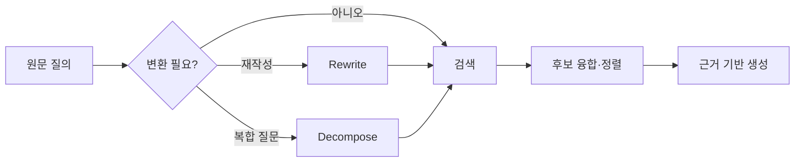

# Query Transformation

Query Transformation은 사용자의 원문 질의를 그대로 검색하는 대신, 검색기가 더 잘 찾을 수 있는 질의로 **재작성·분해·확장·필터링**하는 기술 묶음이다. 생성 품질이 아니라 검색 후보의 재현율과 정밀도를 높이는 것이 목적이다.

## 대표 기법

| 기법 | 하는 일 | 적합한 상황 | 주의점 |
|---|---|---|---|
| Query rewrite | 대명사, 생략어, 구어체를 명확한 검색어로 바꾼다. | 대화 문맥이 있는 짧은 질문 | 원래 의도를 바꾸지 않는다. |
| Multi-query | 서로 다른 관점의 질의를 여러 개 만든다. | 용어가 다양하거나 모호한 질문 | 중복 검색 비용을 제한한다. |
| Decomposition | 복합 질문을 독립 하위 질문으로 나눈다. | 비교, 원인 분석, 다단계 질문 | 마지막에 근거를 다시 통합한다. |
| HyDE | 가상 답변 또는 가상 문서를 만든 뒤 임베딩한다. | 질문과 문서 표현의 간극이 큰 경우 | 가상 답변을 사실 근거로 쓰지 않는다. |
| Metadata filter | 날짜, 권한, 문서 유형, 제품군으로 범위를 좁힌다. | 구조화 메타데이터가 있는 경우 | 필터가 과도하면 정답을 누락한다. |

## 기본 흐름

단순하고 정확한 키워드 질의까지 LLM으로 재작성하면 비용과 오해만 늘어난다. 먼저 규칙 기반 정규화, 메타데이터 필터, [[BM25]] 같은 저비용 검색을 사용하고, 실패 가능성이 큰 경우에만 LLM 변환을 추가한다.

## 좋은 재작성의 조건

- 원문 질의를 보존하고, 변환 질의는 별도 필드로 기록한다.
- 대화에서 명확한 참조만 해소한다. 확실하지 않은 의도는 추측으로 고정하지 않는다.
- 날짜, 제품명, 식별자, 숫자처럼 정확 매칭이 필요한 토큰은 제거하지 않는다.
- 검색 결과가 부족할 때만 완화하거나 확장한다.
- 여러 질의의 결과는 [[Reciprocal Rank Fusion]] 또는 [[Reranking]]으로 합친다.

## 평가

변환 자체가 자연스럽게 보이는지는 중요하지 않다. 같은 질의 집합에 대해 다음을 비교한다.

- 정답 문서가 상위 k개 안에 들어오는 비율(Recall@k)
- 상위 결과의 관련성(Precision@k, nDCG)
- 검색 지연과 추가 LLM 비용
- 변환이 원래 의도나 필수 조건을 훼손한 비율

## 관련

- [[Agentic RAG]]
- [[Hybrid Search]]
- [[BM25]]
- [[Reciprocal Rank Fusion]]
- [[Reranking]]
- [[Grounded Generation]]
