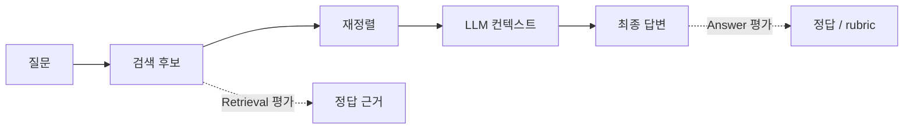

# Retrieval Evaluation

Retrieval Evaluation은 생성된 최종 답변과 분리해, **검색기가 필요한 근거를 실제로 가져왔는지** 측정하는 절차다. 검색 결과에 정답 근거가 없으면 좋은 LLM·프롬프트·reranker도 신뢰할 수 있는 답을 만들 수 없다.

## 무엇을 평가하는가

Retrieval 평가의 정답은 꼭 하나의 문서일 필요가 없다. 문서 ID, 문단, Statement, DB 행, 그래프 경로처럼 **답변을 뒷받침하는 최소 근거 집합**으로 라벨링한다.

## 핵심 지표

| 지표 | 질문 | 해석 |
|---|---|---|
| Recall@k | 정답 근거가 상위 k개에 하나라도 있는가? | 후보 생성의 누락을 본다. |
| Precision@k | 상위 k개 중 관련 근거 비율은? | 컨텍스트 오염을 본다. |
| MRR | 첫 정답 근거가 얼마나 위에 오는가? | 단일 정답형 질문에 유용하다. |
| nDCG@k | 등급별 관련성이 상위에 잘 정렬됐는가? | 여러 관련 문서가 있는 경우에 유용하다. |
| Coverage | 특정 도메인·언어·권한 집단에서 근거를 찾는가? | 평균 점수가 숨기는 사각지대를 본다. |

Recall@k가 낮으면 reranker를 바꾸기 전에 chunking, query transformation, 인덱스, 필터 조건을 고쳐야 한다. Precision@k가 낮으면 후보 수, metadata filter, [[Reranking]]과 컨텍스트 압축을 검토한다.

## 평가 데이터셋

각 사례는 다음을 포함하면 좋다.

- 실제 사용자 질문과 의도
- 허용된 검색 범위와 사용자 권한
- 정답 근거 ID 또는 관련 등급
- 질문 시점에 유효한 문서 버전
- 복합 질문이라면 하위 질문과 필요한 근거 조합

운영 trace에서 실패 사례를 수집하되, 개인정보와 민감 데이터는 먼저 정제한다. 새 문서가 추가되거나 정책이 바뀌면 relevance label도 함께 재검토한다.

## 채널별 ablation

[[Hybrid RAG Search]]처럼 여러 채널을 쓰면 최종 RRF 점수만 보면 원인을 알 수 없다. 같은 질의 집합으로 아래를 비교한다.

1. vector만 사용
2. vector + BM25
3. vector + BM25 + graph 확장
4. 전체 채널 + reranker

채널마다 Recall@k, latency, 비용, 실패율을 기록하면 "그래프가 실제로 recall을 올리는지"와 "특정 문서 필터가 정답을 누락하는지"를 판단할 수 있다.

## 생성 평가와 연결

검색 지표가 높아도 [[Grounded Generation|인용이 틀리거나]] 모델이 근거를 무시할 수 있다. 반대로 답변 점수만 높으면 모델의 사전 지식이 검색 실패를 가린다. 따라서 retrieval, grounding, 최종 답변을 각각 평가하고 같은 trace ID로 연결한다.

## 관련

- [[Evaluation]]
- [[Grounded Generation]]
- [[Hybrid RAG Search]]
- [[Query Transformation]]
- [[Reranking]]
- [[Observability]]

## 참고 자료

- [LangSmith RAG 평가 개요](https://docs.smith.langchain.com/evaluation/tutorials/Developers/rag)
- [RAGAS 문서](https://docs.ragas.io/)
