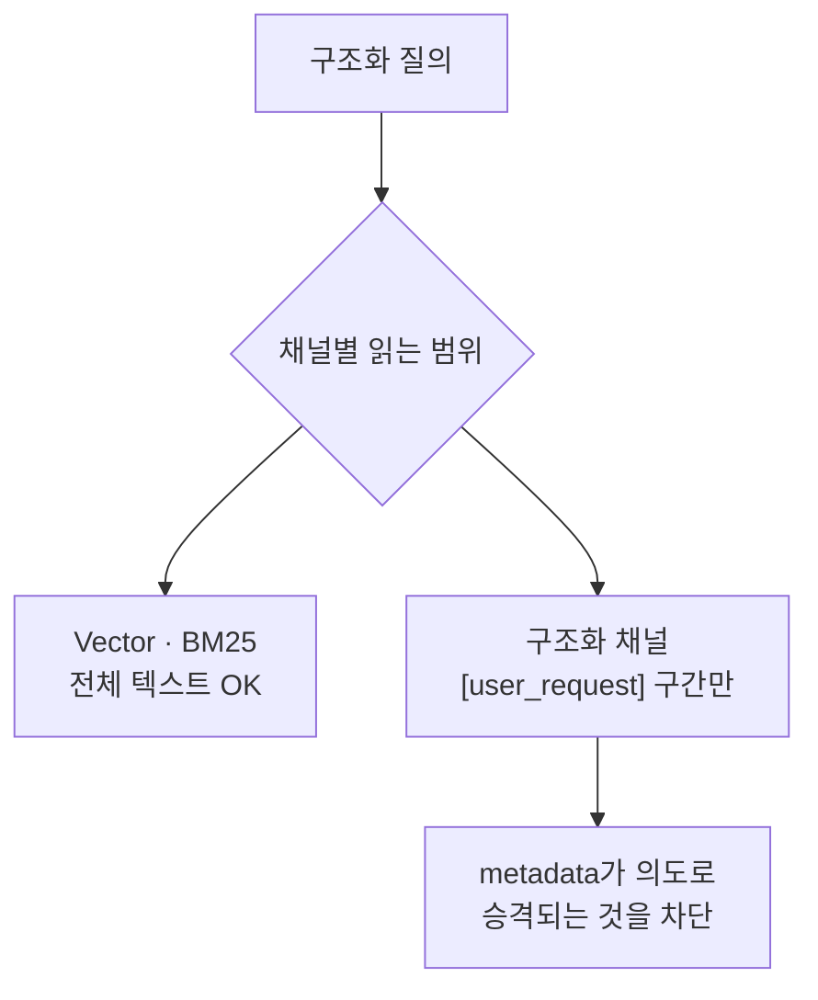

# 구조화 검색 채널

- [[Hybrid RAG Search]]의 네 채널 중 **document filter**에 해당한다. 의미도 어휘도 아닌, **구조가 답인 질의**를 담당한다.
- 예: "category가 visualization인 블록", "TSM 계열 전부".

| 채널 | 질문의 성격 |
|---|---|
| Vector | 의미가 비슷한가 ([[코사인 유사도]]) |
| [[BM25]] | 단어가 겹치는가 |
| **구조화** | 이 속성값을 갖는가 |

## LLM도 임베딩도 안 쓴다

키워드 사전 한 장으로 카테고리 신호를 뽑고, 스냅샷에서 정확 매칭한다.

```python
CATALOG_CATEGORY_KEYWORDS = {
    "visualization": ("히트맵", "산점도", "차트", "그래프", "시각화", "plot", ...),
    "preprocessing": ("결측치", "전처리", "인코딩", "스케일링", ...),
}
```

결정적으로 답이 정해지는 일을 LLM에 시키지 않는다는 원칙의 사례다. 비용도 지연도 0이고, 같은 입력에 항상 같은 결과가 나온다.

## 함정: 보조 사실을 의도로 승격하지 말 것

planner가 만드는 구조화 질의에는 사용자 문장뿐 아니라 캔버스·데이터 사실도 함께 들어간다.

```text
[user_request] 나이로 요금을 회귀 예측해줘
[data_facts] 결측 3건, 범주형 2개
```

이때 `결측`을 보고 preprocessing 카테고리를 잡으면, **명시적인 모델링 요청이 전처리로 오염된다.**



의미 채널은 맥락을 다 받아도 되지만, **결정적 규칙 채널은 사용자가 실제로 말한 부분만 봐야 한다.**

## 한 줄 정리

구조화 채널은 **속성값으로 답이 정해지는 질의를 규칙으로 처리**하고, 사용자 발화 구간만 읽어 의도 오염을 막는다.

## 관련

- [[Hybrid RAG Search]]
- [[Reciprocal Rank Fusion]]
- [[BM25]]
- [[Qdrant 메타데이터 필터]]
