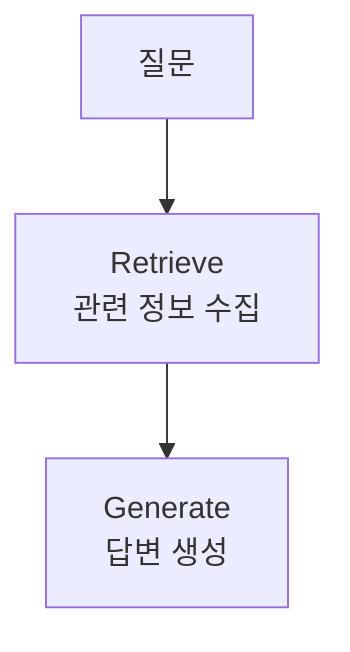
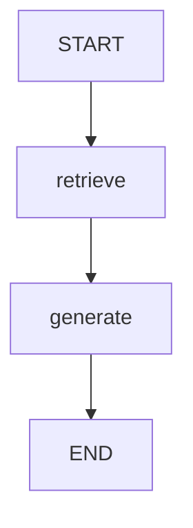
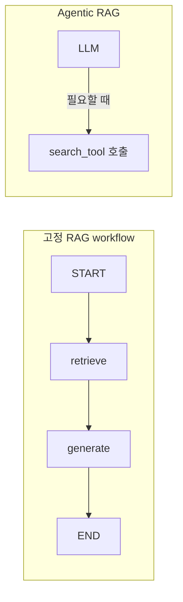

# Retrieve-Generate 패턴

## 정의

Retrieve-Generate 패턴은 답변을 만들기 전에 먼저 관련 정보를 가져오고, 그 정보를 바탕으로 LLM이 답변을 생성하는 구조이다.



이 패턴은 [[RAG(Retrieval-Augmented Generation)]]의 기본 실행 구조이다.

## 기본 예시

```python
def retrieve(state: State):
    question = state["question"]
    docs = [
        "생강차: 몸을 따뜻하게 하고 염증을 가라앉혀 목 통증 완화에 좋다.",
        "닭고기 수프: 수분과 단백질을 보충하고 코막힘을 풀어주는 데 도움이 된다.",
    ]
    return {"context": docs}
```

`retrieve`는 질문에 답하기 위한 참고 문서를 준비한다.

```python
def generate(state: State):
    context = "\n".join(state["context"])
    prompt = f"""다음 문맥을 참고해 질문에 답하세요.

문맥:
{context}

질문: {state["question"]}

답변:"""
    response = llm.invoke(prompt)
    return {"answer": response.content}
```

`generate`는 `context`와 `question`을 조합해 LLM에게 전달한다.

## 하드코딩 예제의 한계

아래처럼 작성된 `retrieve`는 실제 검색을 하지 않는다.

```python
docs = [...]
```

문서를 직접 코드에 적어둔 하드코딩 예제이다.

실무에서는 이 부분이 다음으로 바뀐다.

```python
docs = vector_db.similarity_search(question)
```

또는:

```python
docs = search_api.invoke(question)
```

## LangGraph에서의 위치



`retrieve`와 `generate`는 둘 다 [[LangGraph Node]]이다.

## Tool과의 차이

`retrieve`는 매번 실행되는 워크플로우 단계이다.

반면 검색 기능을 `@tool`로 만들면 LLM이 필요하다고 판단할 때만 검색한다.



관련:

- [[Workflow Node vs Tool]]
- [[Agentic RAG]]
- [[LangGraph StateGraph]]
