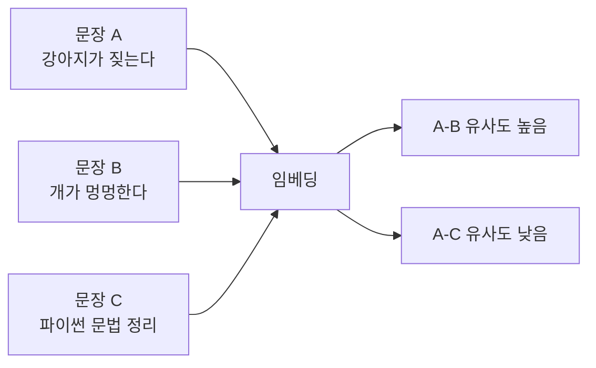

# 코사인 유사도

- 코사인 유사도 = 두 [[임베딩(Embedding)|벡터]]가 **같은 방향을 보고 있는지** 측정하는 방법이다.
- 길이보다 방향을 보므로, 텍스트 의미 유사도 계산에서 자주 쓴다.

## 핵심 직관

- 비슷한 의미의 문장은 벡터 공간에서 비슷한 방향을 향한다.
- 전혀 다른 의미의 문장은 다른 방향을 향한다.



## 값의 의미

| 값 | 느낌 |
|---|---|
| 1에 가까움 | 거의 같은 방향, 의미가 매우 비슷함 |
| 0 근처 | 별 관련 없음 |
| -1에 가까움 | 반대 방향. 텍스트 임베딩에서는 자주 보지는 않음 |

실무에서는 보통 0~1 사이 감각으로 많이 본다.

## 왜 거리보다 방향을 보나

- 문장 벡터의 길이는 모델이나 문장 특성에 영향을 받을 수 있다.
- 코사인 유사도는 길이를 어느 정도 무시하고 방향을 본다.
- 그래서 "내용이 비슷한가"를 볼 때 편하다.

## Python 감각

```python
import numpy as np

def cosine_similarity(a, b):
    return np.dot(a, b) / (np.linalg.norm(a) * np.linalg.norm(b))
```

- `np.dot(a, b)`: 두 벡터가 얼마나 같은 방향인지 본다.
- `np.linalg.norm(...)`: 각 벡터의 길이를 구한다.
- 길이로 나눠서 방향 중심의 점수로 만든다.

## 어디에 쓰이나

- [[RAG(Retrieval-Augmented Generation)]]에서 질문과 문서가 얼마나 비슷한지 검색.
- [[BERTScore]]에서 생성문과 참조문의 토큰 의미가 얼마나 비슷한지 평가.
- [[Intent Classification|의도 분류]]에서 사용자 질문이 어떤 예시와 가까운지 판단.
- 문서 중복 제거, 추천, 클러스터링.

## 한 줄 정리

- 임베딩은 문장을 숫자 벡터로 바꾸는 것.
- 코사인 유사도는 두 벡터가 같은 방향인지 보는 것.
- BERTScore는 이 원리를 이용해 문장끼리 의미가 비슷한지 평가한다.

## 관련

- [[임베딩(Embedding)]]
- [[BERTScore]]
- [[BERT]]
- [[RAG(Retrieval-Augmented Generation)]]
